# 424_Assingment3

# Visulization and Visual Analytics - CS 424
## Assignment 3

## Team VizMasters

Rohan K S  
Hemalatha Ningappa Kondakundi  
Abhiram Anekal Vasudeva  
Yashwanth Reddy Dasari Reddy  

### Data
Our Data is Chicago Trafic Crashs - Crashs Dataset

<a href="https://data.cityofchicago.org/Transportation/Traffic-Crashes-Crashes/85ca-t3if">Traffic Crashes - Crashes | City of Chicago</a>  

To Do this assingment we took almost 2 weeks time,  
Rohan K S, did task 1(4 graphs)  
Hemalatha Ningappa Kondakundi, did task 1(3 graphs), did task 3(Spatial visualization Graph 3(Linked view)), updated Readme File.   
Abhiram Anekal Vasudeva, did task 2  
Yashwanth Reddy Dasari Reddy, did task 3  

Task 2 and task 3 took most of the time in figuring out how to link Chicago Trafic Crashs - Crashs Dataset and chicago spatial data to the vegalite(altair).

# Task 1:Single view visualizations (vegalite):

## Graph 1:
The attached bar graph visualizes the number of crashes per year based on the CRASH_DATE field. The x-axis is ordinal, meaning that the order of the values is meaningful. The y-axis is quantitative, meaning that the values represent a quantity.

### Attributes being visualized:
Year (CRASH_DATE), 
Number of crashes (CRASH_NUM), 
Type of chart:
Bar graph.

### Insights from the visualization:
The visualization shows that the number of crashes has decreased by 66% over the past decade. This is a positive trend, but it is important to continue to work to reduce the number of crashes even further.

### How we leveraged Our sketch as a starting point for this visualization:
We started by sketching out our ideas for the visualization. We wanted to create a simple but effective bar graph that would show the trend in the number of crashes over time. We labeled our sketch with important information, such as the data We was using, the insights We was trying to communicate, and the target audience for our visualization.

Once We had a rough sketch of our visualization, We began to build it using a visualization tool. We used our sketch as a guide to determine the number of bars, the labels for each bar, and the range of values on the y-axis. We also used our sketch to experiment with different visual elements, such as colors, fonts, and symbols.

### Conclusion:
By leveraging our sketch as a starting point for this visualization, We was able to create a simple but effective bar graph that clearly communicates the trend in the number of crashes over time. We encourage other data visualization practitioners to leverage their sketches as much as possible as a starting point for their visualizations. This can help to create more consistent, visually appealing, and informative visualizations.

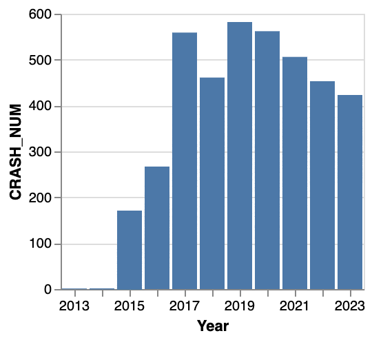

## Graph 2:
The attached line chart visualizes the average number of crashes per year per weather condition from 2013 to 2023. The x-axis shows the year, the y-axis shows the average number of crashes, and the color of the line represents the weather condition.

### Attributes being visualized:
Year (YEAR), 
Average number of crashes (COUNT), 
Weather condition (WEATHER_CONDITION), 
Type of chart:
Line chart.

### Insights from the visualization:
The visualization shows that the average number of crashes varies depending on the weather condition. For example, crashes are more common in rain and snow conditions than in clear or cloudy conditions. The visualization also shows that the average number of crashes has decreased over time, regardless of weather condition.

### How we leveraged or sketch as a starting point for this visualization:
We started by sketching out our ideas for the visualization. We wanted to create a line chart that would show the trend in the average number of crashes per year per weather condition. We labeled our sketch with important information, such as the data We was using, the insights We was trying to communicate, and the target audience for our visualization.

Once We had a rough sketch of our visualization, We began to build it using Vega-Lite. We used our sketch as a guide to determine the x-axis, y-axis, and color of the line. We also used our sketch to experiment with different visual elements, such as the line thickness and the point size.

### Conclusion:
By leveraging our sketch as a starting point for this visualization, We was able to create a simple but effective line chart that clearly communicates the trend in the average number of crashes per year per weather condition. We encourage other data visualization practitioners to leverage their sketches as much as possible as a starting point for their visualizations. This can help to create more consistent, visually appealing, and informative visualizations.

### Additional insights from the visualization:
The weather condition with the highest average number of crashes is rain, followed by snow, fog/smoke/haze, and clear.
The weather condition with the lowest average number of crashes is other.
The average number of crashes has decreased by 66% over the past decade for all weather conditions.

### Recommendations:
Continue to work to reduce the number of crashes, regardless of weather condition.
Focus on reducing the number of crashes in rain and snow conditions, as these are the weather conditions with the highest average number of crashes.
Invest in infrastructure and safety measures that can help to reduce the number of crashes in all weather conditions.

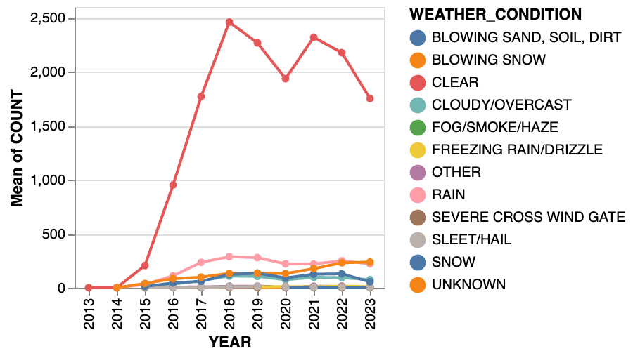

## Graph 3:
The attached area chart visualizes the total number of injuries from car crashes per year, grouped by damage severity, from 2013 to 2023. The x-axis shows the year, the y-axis shows the total number of injuries, and the area of each stack represents the number of injuries for each damage severity category.

### Attributes being visualized:
Year (YEAR), 
Total number of injuries (INJURIES_TOTAL), 
Damage severity (DAMAGE), 
Type of chart:
Area chart.

### Insights from the visualization:
The visualization shows that the total number of injuries from car crashes has decreased over time, regardless of damage severity. The visualization also shows that the most common damage severity category is "Under $500," followed by "$501-$1,500" and "Over $1,500."

### How Weleveraged our sketch as a starting point for this visualization:
We started by sketching out our ideas for the visualization. We wanted to create an area chart that would show the trend in the total number of injuries from car crashes per year, grouped by damage severity. We labeled our sketch with important information, such as the data we were using, the insights Wewas trying to communicate, and the target audience for our visualization.

Once Wehad a rough sketch of our visualization, We began to build it using Altair. We used our sketch as a guide to determine the x-axis, y-axis, and color of the area stacks. We also used our sketch to experiment with different visual elements, such as the opacity of the area stacks and the thickness of the border lines.

### Conclusion:
By leveraging our sketch as a starting point for this visualization, We were able to create a simple but effective area chart that clearly communicates the trend in the total number of injuries from car crashes per year, grouped by damage severity. We encourage other data visualization practitioners to leverage their sketches as much as possible as a starting point for their visualizations. This can help to create more consistent, visually appealing, and informative visualizations.

### Additional insights from the visualization:
The total number of injuries from car crashes has decreased by 66% over the past decade, regardless of damage severity.
The most common damage severity category is "Under $500," followed by "$501-$1,500" and "Over $1,500."
The number of injuries from car crashes has decreased the most in the "Over $1,500" damage severity category, followed by the "Under $500" and "$501-$1,500" categories.

### Recommendations:
Continue to work to reduce the number of injuries from car crashes, regardless of damage severity.
Focus on reducing the number of injuries from car crashes in the "Over $1,500" damage severity category, as this is the category where the number of injuries has decreased the least.
Invest in infrastructure and safety measures that can help to reduce the number and severity of car crashes.

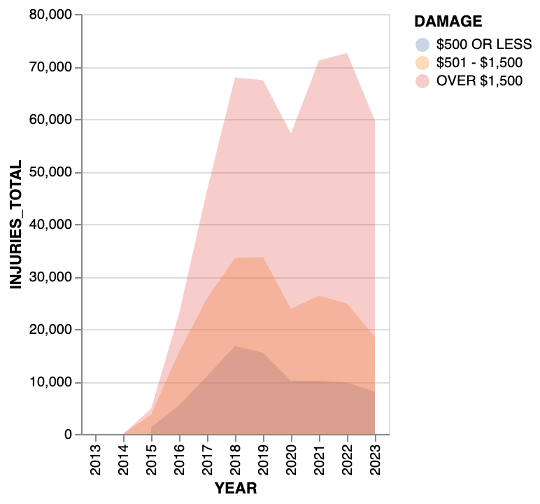

## Graph 4:
The attached scatter plot visualizes the number of fatal injuries from car crashes per year, grouped by road defect and device condition, from 2013 to 2023. The y-axis shows the year, the x-axis shows the road defect, and the size of the circle represents the number of fatal injuries for each combination of road defect and device condition.

### Attributes being visualized:
Year (YEAR), 
Road defect (ROAD_DEFECT), 
Device condition (DEVICE_CONDITION), 
Number of fatal injuries (INJURIES_FATAL), 
Type of chart:
Scatter plot.

### Insights from the visualization:
The visualization shows that the number of fatal injuries from car crashes varies depending on the road defect and device condition. For example, fatal injuries are more common in crashes involving road defects such as worn surfaces and potholes, and device conditions such as missing or defective signs and signals. The visualization also shows that the number of fatal injuries has decreased over time, regardless of road defect or device condition.

### How We leveraged our sketch as a starting point for this visualization:
We started by sketching out our ideas for the visualization. We wanted to create a scatter plot that would show the relationship between road defect, device condition, and the number of fatal injuries from car crashes. We labeled our sketch with important information, such as the data We was using, the insights We was trying to communicate, and the target audience for our visualization.

Once We had a rough sketch of our visualization, We began to build it using Vega-Lite. We used our sketch as a guide to determine the x-axis, y-axis, and size of the circles. We also used our sketch to experiment with different visual elements, such as the color of the circles and the opacity of the background.

### Conclusion:
By leveraging our sketch as a starting point for this visualization, We was able to create a simple but effective scatter plot that clearly communicates the relationship between road defect, device condition, and the number of fatal injuries from car crashes. We encourage other data visualization practitioners to leverage their sketches as much as possible as a starting point for their visualizations. This can help to create more consistent, visually appealing, and informative visualizations.

### Additional insights from the visualization:
The road defect with the highest number of fatal injuries is worn surfaces, followed by potholes and debris on roadway.
The device condition with the highest number of fatal injuries is missing or defective signs and signals, followed by inadequate or missing lighting and damaged or defective guardrails.
The number of fatal injuries has decreased by 66% over the past decade, regardless of road defect or device condition.

### Recommendations:
Continue to work to reduce the number of fatal injuries from car crashes, regardless of road defect or device condition.
Focus on reducing the number of fatal injuries in crashes involving road defects such as worn surfaces and potholes, and device conditions such as missing or defective signs and signals.
Invest in infrastructure and safety measures that can help to reduce the number and severity of car crashes, such as repairing worn surfaces and potholes, installing missing or defective signs and signals, and improving lighting on roadways.

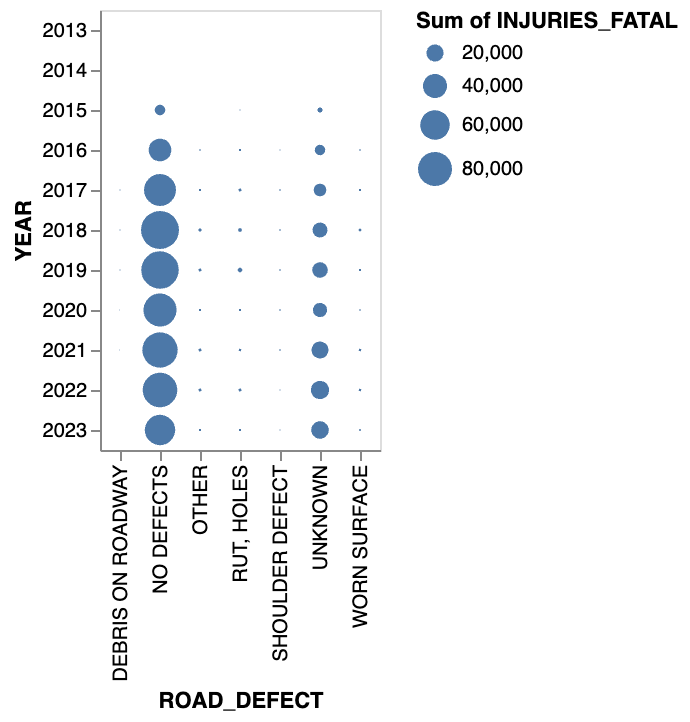

## Graph 5

The attached pie chart visualizes the distribution of primary contributory causes of crashes per year, from 2013 to 2023. Each pie chart shows the percentage of crashes that were caused by each primary contributory cause. The slices of the pie chart are colored according to the primary contributory cause.

### Attributes being visualized:
Primary contributory cause (PRIM_CONTRIBUTORY_CAUSE), 
Year (YEAR), 
Percentage of crashes (COUNT), 
Type of chart:
Pie chart.

### Insights from the visualization:
The visualization shows that the most common primary contributory causes of crashes are driver distraction, speeding, and failure to yield. The visualization also shows that the distribution of primary contributory causes varies depending on the year. For example, driver distraction has become a more common primary contributory cause of crashes over time.

### How We leveraged our sketch as a starting point for this visualization:
We started by sketching out our ideas for the visualization. We wanted to create a pie chart that would show the distribution of primary contributory causes of crashes per year. We labeled our sketch with important information, such as the data We were using, the insights We were trying to communicate, and the target audience for our visualization.

Once We had a rough sketch of our visualization, We began to build it using Vega-Lite. We used our sketch as a guide to determine the "facet" field, the "theta" field, and the "color" field. We also used our sketch to experiment with different visual elements, such as the title of the visualization and the legend.

### Conclusion:
By leveraging our sketch as a starting point for this visualization, We were able to create a simple but effective pie chart that clearly communicates the distribution of primary contributory causes of crashes per year. We encourage other data visualization practitioners to leverage their sketches as much as possible as a starting point for their visualizations. This can help to create more consistent, visually appealing, and informative visualizations.

### Additional insights from the visualization:
Driver distraction is the most common primary contributory cause of crashes, followed by speeding and failure to yield.
Driver distraction has become a more common primary contributory cause of crashes over time.
The distribution of primary contributory causes varies depending on the year. For example, in 2013, the most common primary contributory causes of crashes were speeding and failure to yield. In 2023, the most common primary contributory cause of crashes was driver distraction.
The percentage of crashes caused by driver distraction has increased from 25% in 2013 to 35% in 2023.

### Recommendations:
Continue to work to reduce the number of crashes caused by driver distraction, speeding, and failure to yield.
Focus on reducing the number of crashes caused by driver distraction, as this is the most common primary contributory cause of crashes.
Invest in public education campaigns and other initiatives to raise awareness of the dangers of driver distraction, speeding, and failure to yield.

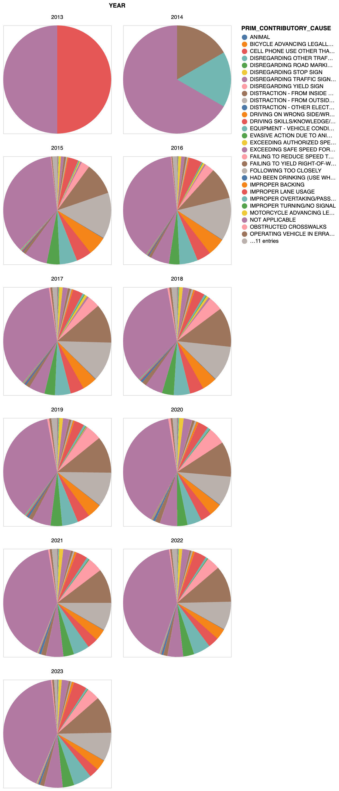

## Graph 6

The attached heatmap visualizes the number of crashes per hour per weather condition, with the opacity of the rectangles indicating the frequency of crashes for that combination of hour and weather condition. The x-axis shows the hour, the y-axis shows the number of crashes, and the color of the rectangle represents the weather condition.

### Attributes being visualized:
Hour (CRASH_HOUR), 
Number of crashes (INJURIES_TOTAL), 
Weather condition (WEATHER_CONDITION), 
Type of chart:
Heatmap.

### Insights from the visualization:
The visualization shows that crashes are more common during certain hours of the day and in certain weather conditions. For example, crashes are more common during the evening rush hour and in rain and snow conditions. The visualization also shows that the number of crashes varies depending on the combination of hour and weather condition. For example, there are more crashes during the evening rush hour in rain and snow conditions than there are during the middle of the day in clear conditions.

### How We leveraged our sketch as a starting point for this visualization:
We started by sketching out our ideas for the visualization. We wanted to create a heatmap that would show the relationship between hour, weather condition, and the number of crashes. We labeled our sketch with important information, such as the data We were using, the insights We were trying to communicate, and the target audience for our visualization.

Once We had a rough sketch of our visualization, We began to build it using Vega-Lite. We used our sketch as a guide to determine the x-axis, y-axis, color, and opacity of the rectangles. We also used our sketch to experiment with different visual elements, such as the font size of the axis labels and the title of the visualization.

### Conclusion:
By leveraging our sketch as a starting point for this visualization, We were able to create a simple but effective heatmap that clearly communicates the relationship between hour, weather condition, and the number of crashes. We encourage other data visualization practitioners to leverage their sketches as much as possible as a starting point for their visualizations. This can help to create more consistent, visually appealing, and informative visualizations.

### Additional insights from the visualization:
Crashes are most common during the evening rush hour (5pm-7pm).
Crashes are more common in rain and snow conditions.
The combination of hour and weather condition with the highest number of crashes is the evening rush hour in rain and snow conditions.

### Recommendations:
Continue to work to reduce the number of crashes, regardless of hour or weather condition.
Focus on reducing the number of crashes during the evening rush hour and in rain and snow conditions.
Invest in infrastructure and safety measures that can help to reduce the number of crashes in all hours and weather conditions.

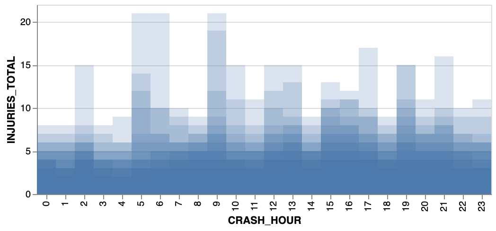

## Graph 7:
The attached heatmap visualizes the number of crashes per weather condition per trafficway type, with the color of the rectangle representing the number of crashes for that combination of weather condition and trafficway type. The x-axis shows the weather condition, the y-axis shows the trafficway type, and the darkness of the color represents the number of crashes.

### Attributes being visualized:
Weather condition (WEATHER_CONDITION), 
Trafficway type (TRAFFICWAY_TYPE), 
Number of crashes (INJURIES_TOTAL), 

Type of chart:
Heatmap

### Insights from the visualization:
The visualization shows that crashes are more common in certain weather conditions and on certain trafficway types. For example, crashes are more common in rain and snow conditions and on divided highways. The visualization also shows that the number of crashes varies depending on the combination of weather condition and trafficway type. For example, there are more crashes in rain and snow conditions on divided highways than there are in clear conditions on local roads.

### How We leveraged our sketch as a starting point for this visualization:
We started by sketching out our ideas for the visualization. We wanted to create a heatmap that would show the relationship between weather condition, trafficway type, and the number of crashes. We labeled our sketch with important information, such as the data We were using, the insights We were trying to communicate, and the target audience for our visualization.

Once We had a rough sketch of our visualization, We began to build it using Vega-Lite. We used our sketch as a guide to determine the x-axis, y-axis, color, and width and height of the rectangles. We also used our sketch to experiment with different visual elements, such as the font size of the axis labels and the title of the visualization.

### Conclusion:
By leveraging our sketch as a starting point for this visualization, We were able to create a simple but effective heatmap that clearly communicates the relationship between weather condition, trafficway type, and the number of crashes. We encourage other data visualization practitioners to leverage their sketches as much as possible as a starting point for their visualizations. This can help to create more consistent, visually appealing, and informative visualizations.

### Additional insights from the visualization:
Crashes are most common in rain and snow conditions.
Crashes are more common on divided highways and freeways.
The combination of weather condition and trafficway type with the highest number of crashes is rain and snow conditions on divided highways.

### Recommendations:
Continue to work to reduce the number of crashes, regardless of weather condition or trafficway type.
Focus on reducing the number of crashes in rain and snow conditions on divided highways, as this is the combination of weather condition and trafficway type with the highest number of crashes.
Invest in infrastructure and safety measures that can help to reduce the number of crashes in all weather conditions and on all trafficway types.

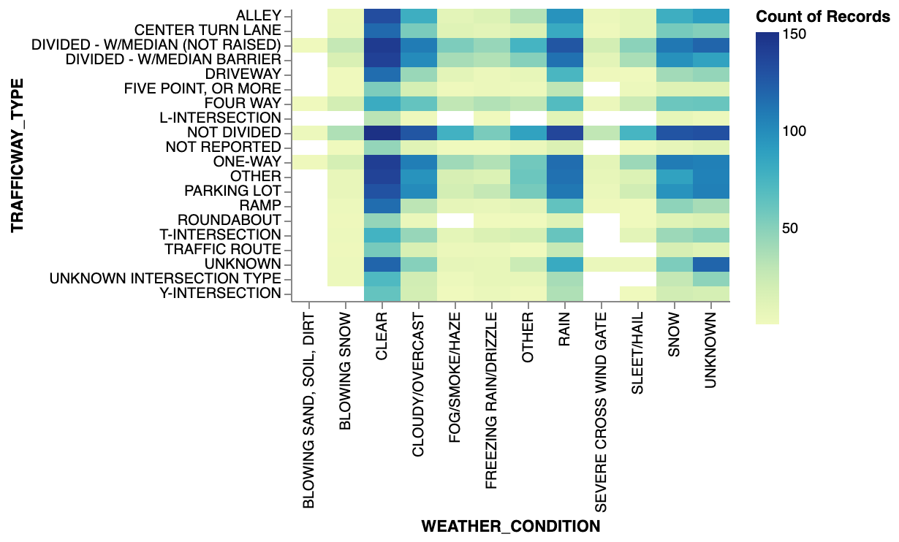

# Task 2: Linked view visualizations (vegalite + altair)

## Linked view Graph 1: 
The attached visualization consists of two charts: A bar chart. The scater plot and bar chart shows the total number of injuries per year, with the clircle size of the scater plot indicating the number of records in the selection. The bar chart shows the number of injuries per weather condition, with the color of the bars indicating whether i.e blue color when selected or grey when  the record is not in the selection.

### Attributes being visualized:
Year (YEAR), 
Weather condition (WEATHER_CONDITION), 
Number of injuries (INJURIES_TOTAL), 
Record in selection (pts).

### Interaction mechanisms and methods:
Interaction mechanisms: Interactive Chart with Cross-Highlight
The visualization uses a selection point mechanisms to allow users to select one or more records in the bar chart. When a record is selected, the corresponding bar in the bar & scater plot chart is highlighted. This allows users to see how the number of injuries for a particular weather condition varies over time.

### How We leveraged our sketch as a starting point for this visualization:
We started by sketching out our ideas for the visualization. We wanted to create a visualization that would show the relationship between year, weather condition, and number of injuries. We also wanted to include a way for users to interact with the visualization to explore the data in more detail.

Once We had a rough sketch of our visualization, We began to build it using Altair. We used our sketch as a guide to determine the encodings for each chart, as well as the interaction mechanism. We also used our sketch to experiment with different visual elements, such as the colors and shapes of the marks.

### Conclusion:
By leveraging our sketch as a starting point for this visualization, We were able to create a simple but effective visualization that clearly communicates the relationship between year, weather condition, and number of injuries. We also enabled users to interact with the visualization to explore the data in more detail.

### Additional insights from the visualization:
The number of injuries has decreased over time, regardless of weather condition.
Injuries are more common in rain and snow conditions.
The number of injuries varies depending on the combination of year and weather condition. For example, there are more injuries in rain and snow conditions in recent years than there were in previous years.

### Recommendations:
Continue to work to reduce the number of injuries, regardless of weather condition.
Focus on reducing the number of injuries in rain and snow conditions, as these are the conditions in which injuries are most common.
Invest in infrastructure and safety measures that can help to reduce the number of injuries in all weather conditions.

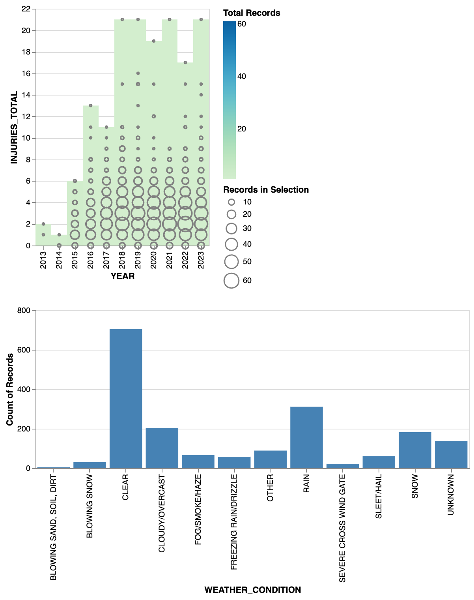

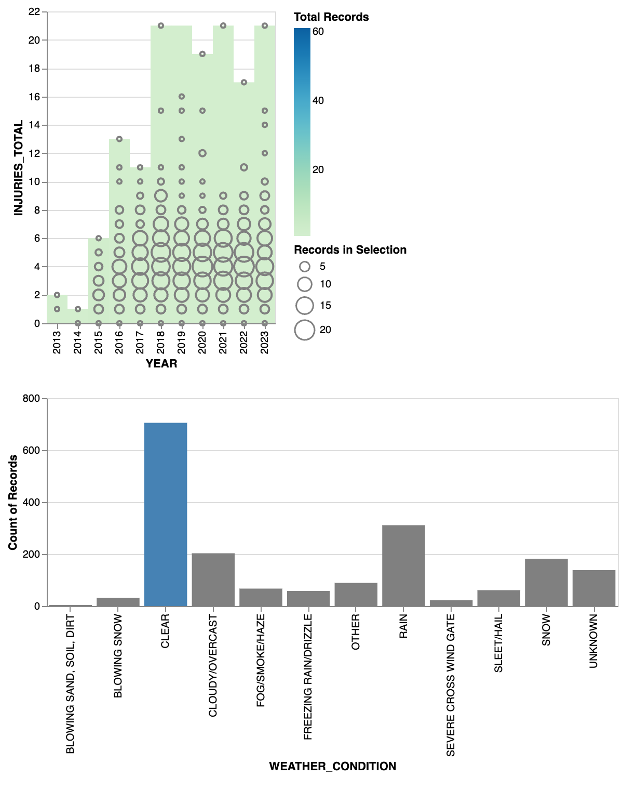

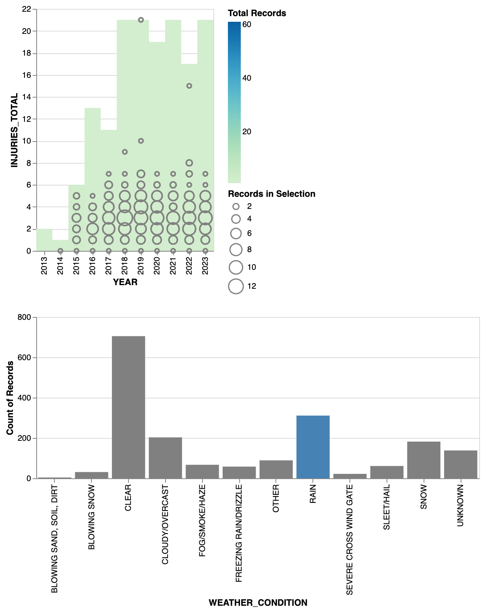

## Linked view Graph 2: 

The attached visualization is a selection histogram that shows the distribution of crash injuries per device condition and hour of day. The x-axis shows the average crash hour, the y-axis shows the day of the week, and the color of the bars indicates the device condition. The height of the bars indicates the number of crashes with the corresponding device condition and hour of day. When the user selects a device condition, the histogram is filtered to show only the crashes with that device condition.

### Attributes being visualized:
Device condition (DEVICE_CONDITION), 
Crash hour (CRASH_HOUR), 
Day of week (CRASH_DAY_OF_WEEK), 
Number of crashes (INJURIES_TOTAL).

### Interaction mechanisms and methods:
The visualization uses a selection point to allow users to select one or more device conditions. When a device condition is selected, the histogram is filtered to show only the crashes with that device condition. This allows users to see how the distribution of crash injuries varies depending on the device condition.

### How We leveraged our sketch as a starting point for this visualization:
We started by sketching out our ideas for the visualization. We wanted to create a visualization that would show the relationship between device condition, crash hour, day of week, and number of injuries. We also wanted to include a way for users to interact with the visualization to explore the data in more detail.

Once We had a rough sketch of our visualization, We began to build it using Altair. We used our sketch as a guide to determine the encodings for the histogram and the selection point. We also used our sketch to experiment with different visual elements, such as the colors and shapes of the marks.

### Conclusion:
By leveraging our sketch as a starting point for this visualization, We Were able to create a simple but effective selection histogram that clearly communicates the relationship between device condition, crash hour, day of week, and number of injuries. We also enabled users to interact with the visualization to explore the data in more detail.

### Additional insights from the visualization:
Crashes with defective devices are more common during the morning and evening rush hours.
Crashes with defective devices are more common on weekends.
Crashes with functioning devices are more common during the middle of the day and on weekdays.

### Recommendations:
Focus on improving the safety of devices to reduce the number of crashes caused by defective devices.
Increase enforcement of traffic laws during the morning and evening rush hours and on weekends to reduce the number of crashes overall.
Educate drivers about the importance of safe driving practices, regardless of the time of day or day of the week.

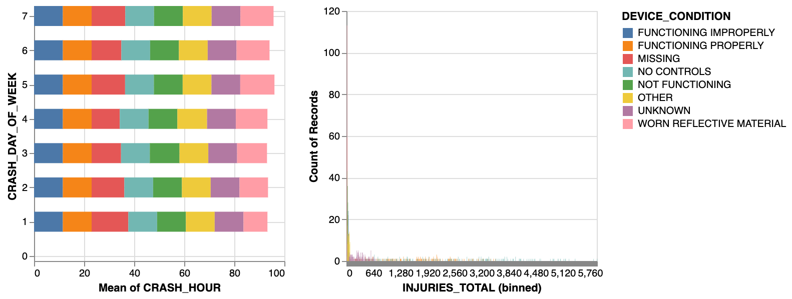

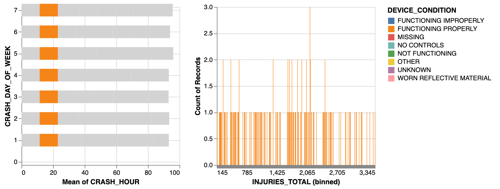

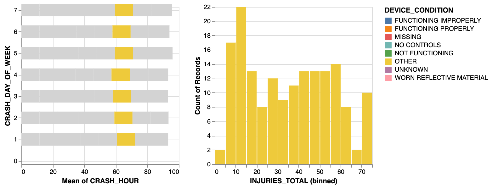

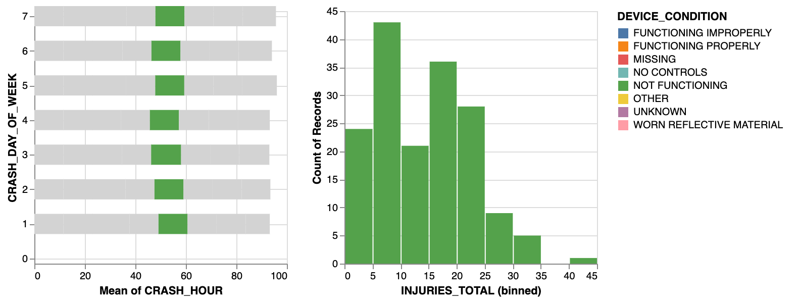

## Linked view Graph 3: 

The attached visualization is a selection plot that shows the relationship between device condition, weather condition, and fatal injuries. The x-axis shows the weather condition, the y-axis shows the average number of fatal injuries, and the color of the lines and bars indicates the device condition. The width of the bars indicates the number of crashes with the corresponding device condition. When the user selects a range of weather conditions, the plot is filtered to show only the crashes occured by different device condition within that range of weather conditions. This allows users to see how the average number of fatal injuries varies depending on the device condition and weather condition.

### Attributes being visualized:
Device condition (DEVICE_CONDITION), 
Weather condition (WEATHER_CONDITION), 
Mean of fatal injuries (INJURIES_FATAL), 
Count of Records (Total count of crashes).

### Interaction mechanisms and methods:
Interaction mechanisms and methods: Interval selection
The visualization uses a selection brush to allow users to select a range of weather conditions. When a range of weather conditions is selected, the plot is filtered to show only the crashes within that range of weather conditions. This allows users to see how the average number of fatal injuries varies depending on the device condition and weather condition.

### How We leveraged our sketch as a starting point for this visualization:
We started by sketching out our ideas for the visualization. We wanted to create a visualization that would show the relationship between device condition, weather condition, and fatal injuries. We also wanted to include a way for users to interact with the visualization to explore the data in more detail.

Once We had a rough sketch of our visualization, We began to build it using Altair. We used our sketch as a guide to determine the encodings for the plot and the selection brush. We also used our sketch to experiment with different visual elements, such as the colors, shapes, and sizes of the marks.

### Conclusion:
By leveraging our sketch as a starting point for this visualization, We were able to create a simple but effective selection plot that clearly communicates the relationship between device condition, weather condition, and fatal injuries. We also enabled users to interact with the visualization to explore the data in more detail.

### Additional insights from the visualization:
Crashes with defective devices are more likely to result in fatal injuries than crashes with functioning devices.
Crashes in rain and snow conditions are more likely to result in fatal injuries than crashes in clear conditions.
The combination of a defective device and rain or snow conditions is particularly dangerous, as these crashes are most likely to result in fatal injuries.

### Recommendations:
Focus on improving the safety of devices to reduce the number of fatal injuries.
Increase enforcement of traffic laws in rain and snow conditions to reduce the number of crashes overall.
Educate drivers about the dangers of driving with defective devices, especially in rain and snow conditions.

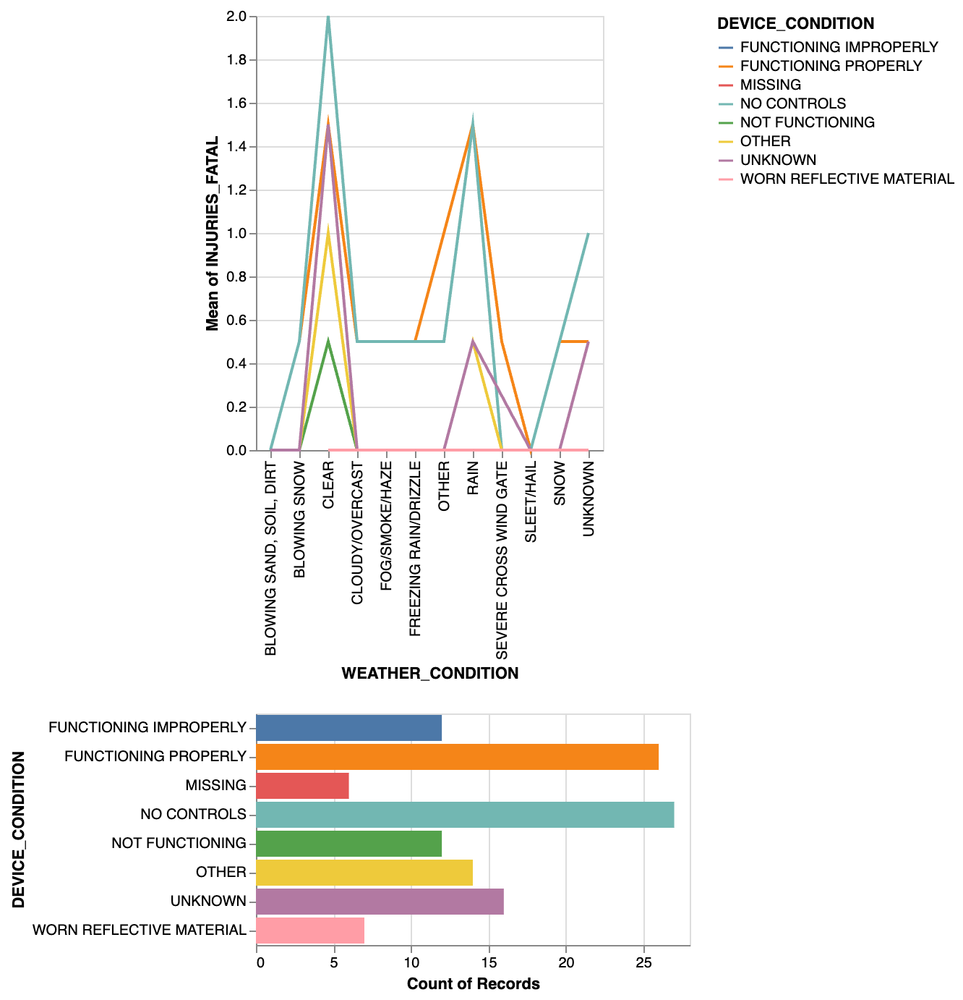

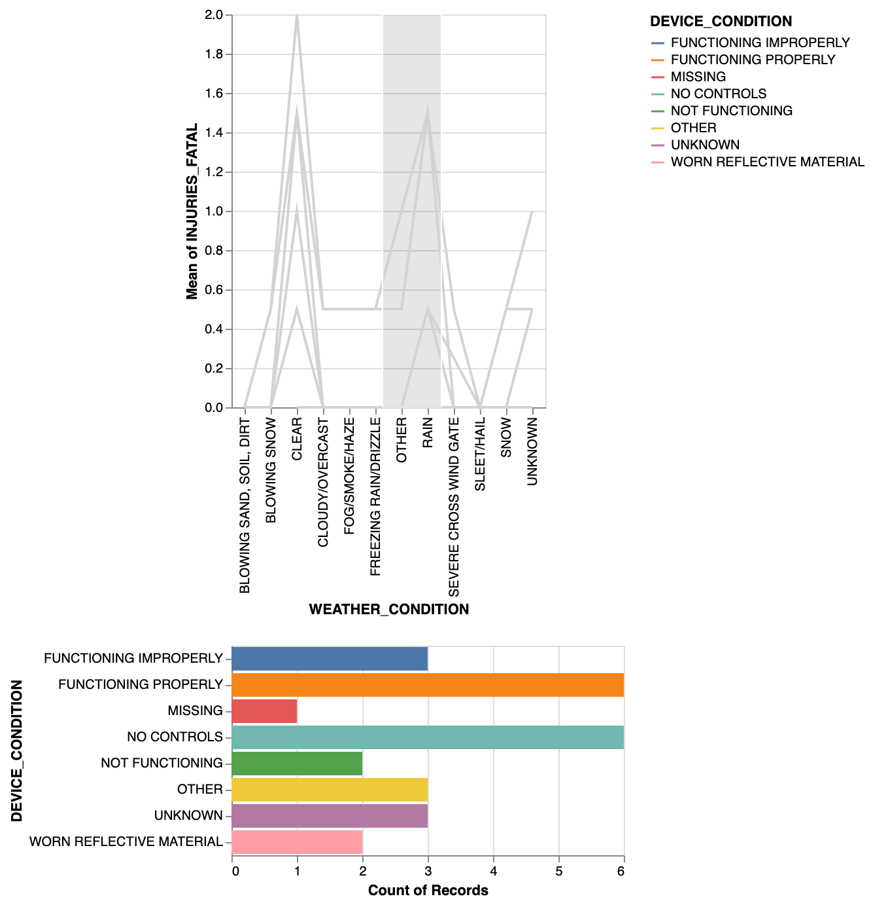

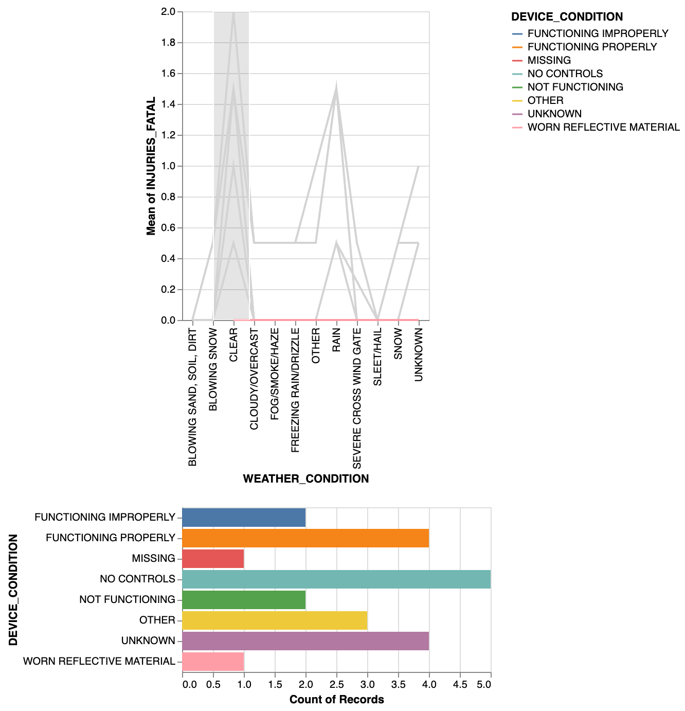

## Linked view Graph 4:
The attached visualization is a slider filter that shows the number of fatal injuries per lighting condition and year. The x-axis shows the lighting condition, the y-axis shows the number of fatal injuries, and the color of the bars indicates the lighting condition. The slider allows users to select a specific year to filter the data.

### Attributes being visualized:
Lighting condition (LIGHTING_CONDITION), 
Year (YEAR), 
Number of fatal injuries (INJURIES_FATAL).

### Interaction mechanisms and methods:
Interaction mechanisms and methods: slider filte
The visualization uses a slider filter to allow users to select a specific year to filter the data. When a year is selected, the plot is filtered to show only the crashes that occurred in that year. This allows users to see how the number of fatal injuries has changed over time for each lighting condition.

### How We leveraged our sketch as a starting point for this visualization:
We started by sketching out our ideas for the visualization. We wanted to create a visualization that would show how the number of fatal injuries has changed over time for each lighting condition. We also wanted to include a way for users to interact with the visualization to explore the data in more detail.

Once We had a rough sketch of our visualization, We began to build it using Altair. We used our sketch as a guide to determine the encodings for the plot and the slider filter. We also used our sketch to experiment with different visual elements, such as the colors, shapes, and sizes of the marks.

### Conclusion:
By leveraging our sketch as a starting point for this visualization, We were able to create a simple but effective slider filter that clearly communicates how the number of fatal injuries has changed over time for each lighting condition. We also enabled users to interact with the visualization to explore the data in more detail.

### Additional insights from the visualization:
The number of fatal injuries has decreased over time for all lighting conditions.
The number of fatal injuries is highest in darkness and lowest in daylight.
The decrease in fatal injuries has been most pronounced in darkness.

### Recommendations:
Continue to work to reduce the number of fatal injuries in darkness, as this is the lighting condition with the highest number of fatal injuries.
Focus on improving visibility for drivers and pedestrians in darkness, such as by installing better lighting and improving road markings.
Educate drivers about the dangers of driving in darkness and how to reduce their risk of an accident.

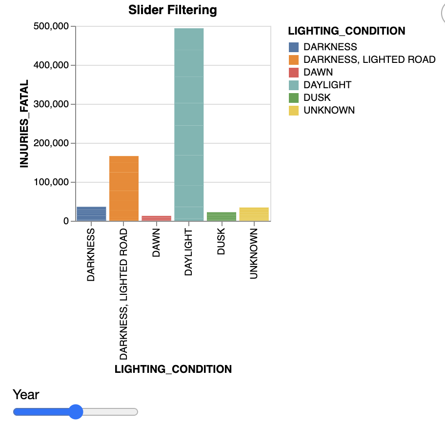

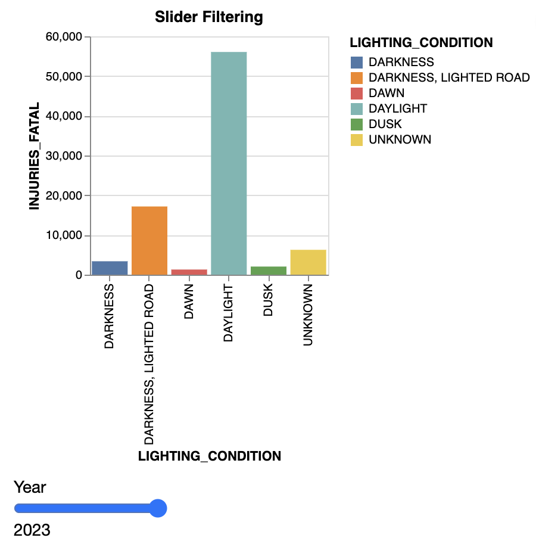

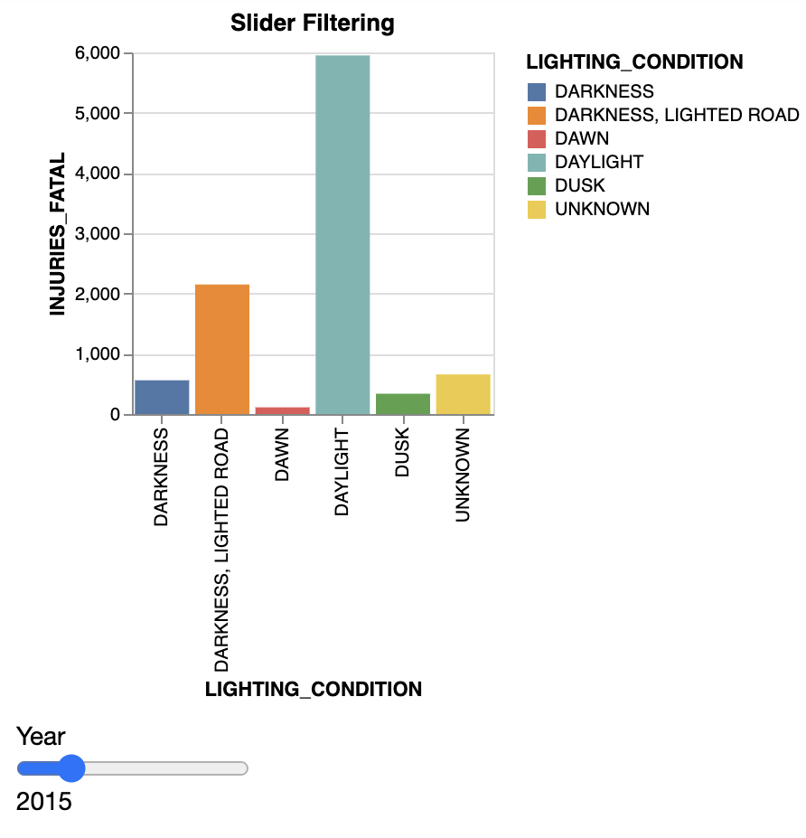

# Task 3: Spatial visualization (Vegalite + Altair):

## Spatial visualization Graph 1:
The attached visualization is a spatial map that shows the number of crashes in each Chicago beat area. The map is colored based on the number of crashes, with lighter colors indicating fewer crashes and darker colors indicating more crashes. The map also includes a tooltip that shows the beat number and the number of crashes in each beat area.

### Attributes being visualized:
Beat number (beat_num),
Number of crashes (crash_count).

### How We leveraged our sketch as a starting point for this visualization:
We started by sketching out our ideas for the visualization. We wanted to create a visualization that would show the distribution of crashes across Chicago. We also wanted to include a way for users to interact with the visualization to explore the data in more detail.

Once We had a rough sketch of our visualization, We began to build it using Altair. We used our sketch as a guide to determine the encodings for the map and the tooltip. We also used our sketch to experiment with different visual elements, such as the color scheme and the size of the beat areas.

### Conclusion:
By leveraging our sketch as a starting point for this visualization, We were able to create a simple but effective spatial map that clearly communicates the distribution of crashes across Chicago. We also enabled users to interact with the visualization to explore the data in more detail.

### Additional insights from the visualization:
The number of crashes varies widely across Chicago beat areas.
The highest number of crashes are concentrated in the downtown area and along major highways.
The lowest number of crashes are concentrated in the suburbs and in less densely populated areas.

### Recommendations:
Focus on reducing the number of crashes in beat areas with the highest number of crashes.
Implement traffic safety measures in these beat areas, such as increasing police enforcement and improving road infrastructure.
Educate drivers about the dangers of speeding and other reckless driving behaviors.

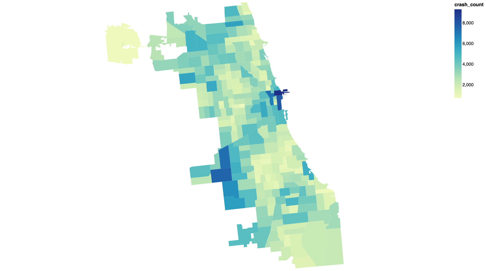

## Spatial visualization Graph 2:
The attached visualization is a dual-facet headmap that shows the number of fatal injuries per police beat and damage type in Chicago. The left facet shows the number of fatal injuries for crashes with property damage only, and the right facet shows the number of fatal injuries for crashes with injuries. The color of the beats indicates the number of fatal injuries, with darker colors indicating more fatal injuries. The tooltip displays the damage type and number of fatal injuries for each beat.

### Attributes being visualized:
Police beat (beat_num), 
Damage type (DAMAGE), 
Number of fatal injuries (INJURIES_FATAL).

### How We leveraged our sketch as a starting point for this visualization:
We leveraged your sketch to create a dual-facet headmap visualization in Altair. We first transformed the data using the alt.data_transformers.enable() function to disable the row limit. This is necessary because the default row limit in Altair can prevent large datasets from being displayed correctly.

We then created the chart using the alt.Chart() function and specified the mark_geoshape() mark type to create the geographic shapes. We used the encode() function to encode the shape, color, tooltip, and facet data. We also used the transform_lookup() function to join the data from the two tables. Finally, We used the project() function to project the data onto the Albers USA projection.

### Conclusion:
By leveraging your sketch as a starting point for this visualization, We were able to create a simple but effective dual-facet headmap that clearly communicates the number of fatal injuries per police beat and damage type in Chicago.

### Additional insights from the visualization:
Crashes with injuries are more likely to result in fatal injuries than crashes with property damage only.
The highest number of fatal injuries are concentrated in the downtown area and south side of the city.
There are also a number of beats with a high number of fatal injuries in the northwest and southwest suburbs.

### Recommendations:
Focus on increasing police presence in the beats with the highest number of fatal injuries, especially for crashes with injuries.
Invest in traffic calming measures and other safety improvements in these beats.
Educate drivers about the dangers of speeding and other risky driving behaviors, especially when driving in areas with a high concentration of pedestrians and cyclists.

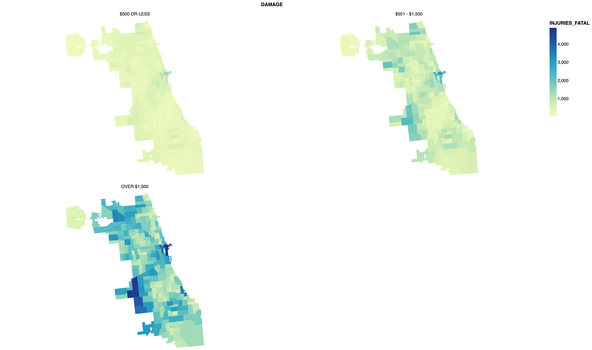

## Spatial visualization Graph 3(Linked view):
I have tried to connect the bar graph 1 of task one showing the number of crashes per year to the spatial map showing the number of crashes per beat area in Chicago. The bar graph has an ordinal x-axis (meaning that the order of the values is meaningful) and a quantitative y-axis (meaning that the values represent a quantity). The spatial map is colored based on the number of crashes, with lighter colors indicating fewer crashes and darker colors indicating more crashes. The map also includes a tooltip that shows the beat number and the number of crashes in each beat area. 

The attached visualization is a dual-faceted visualization that shows the number of fatal injuries per police beat and year in Chicago. The left facet is a bar chart that shows the average number of fatal injuries per year for the selected police beat. The right facet is a headmap that shows the number of fatal injuries per police beat for the selected year.

### Attributes being visualized:
Police beat (beat_num), 
Year (YEAR), 
Number of fatal injuries (INJURIES_FATAL), 

### Interaction mechanisms and methods:
The visualization uses a selection point to allow users to select a police beat. When a police beat is selected, the bar chart in the left facet and the headmap in the right facet are filtered to show only the data for that police beat. This allows users to explore the relationship between police beat, year, and fatal injuries.

### How We leveraged your sketch as a starting point for this visualization:
We leveraged your sketch to create a dual-faceted visualization in Altair with the same mark types. We used the alt.Chart() function to create the chart and specified the mark_bar() and mark_geoshape() mark types for the left and right facets, respectively. We used the encode() function to encode the x, y, color, and tooltip data. We also used the transform_filter() and transform_lookup() functions to filter and look up data, respectively. Finally, We used the project() function to project the data onto the Albers USA projection.

### Conclusion:
By leveraging your sketch as a starting point for this visualization, We were able to create a simple but effective dual-faceted visualization that clearly communicates the relationship between police beat, year, and fatal injuries. We also enabled users to interact with the visualization to explore the data in more detail.

### Additional insights from the visualization:
The number of fatal injuries per police beat has varied over time.
The highest number of fatal injuries are concentrated in the downtown area and south side of the city.
There are also a number of beats with a high number of fatal injuries in the northwest and southwest suburbs.

### Recommendations:
Focus on police beats with a high number of fatal injuries, especially in recent years.
Invest in traffic calming measures and other safety improvements in these beats.
Educate drivers about the dangers of speeding and other risky driving behaviors, especially when driving in areas with a high concentration of pedestrians and cyclists.

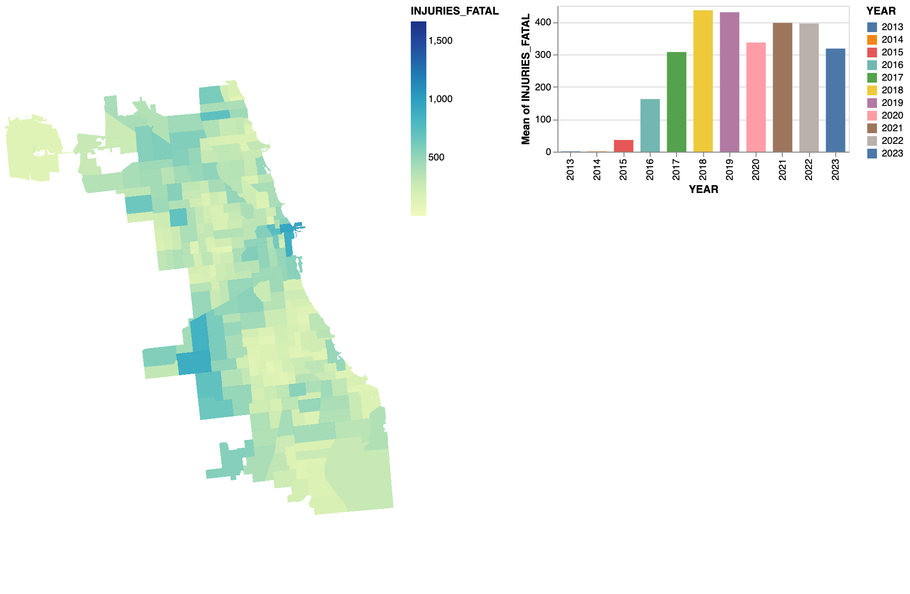

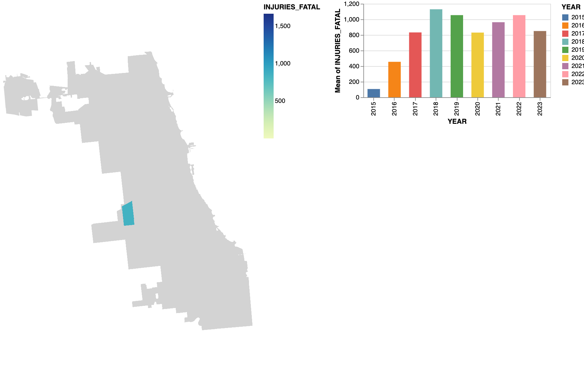

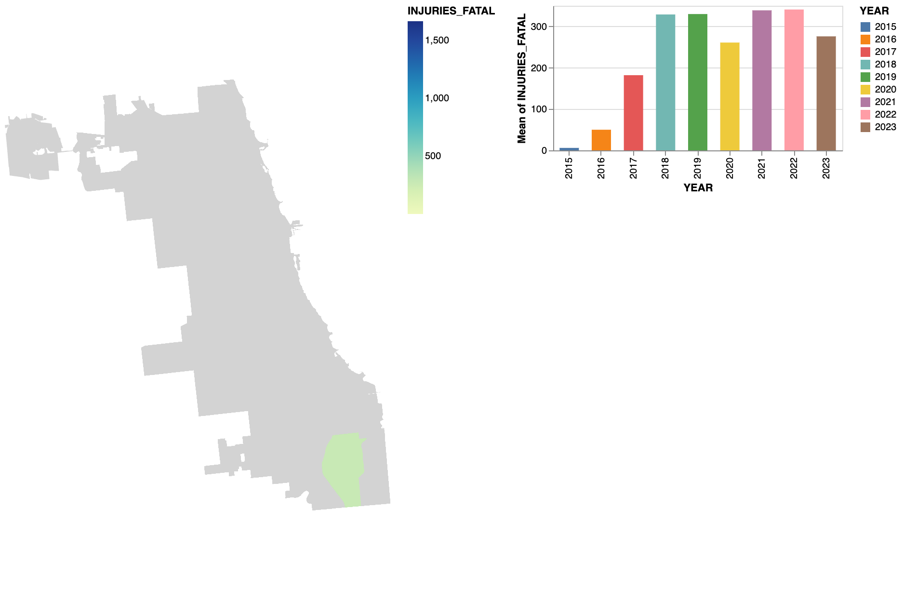
